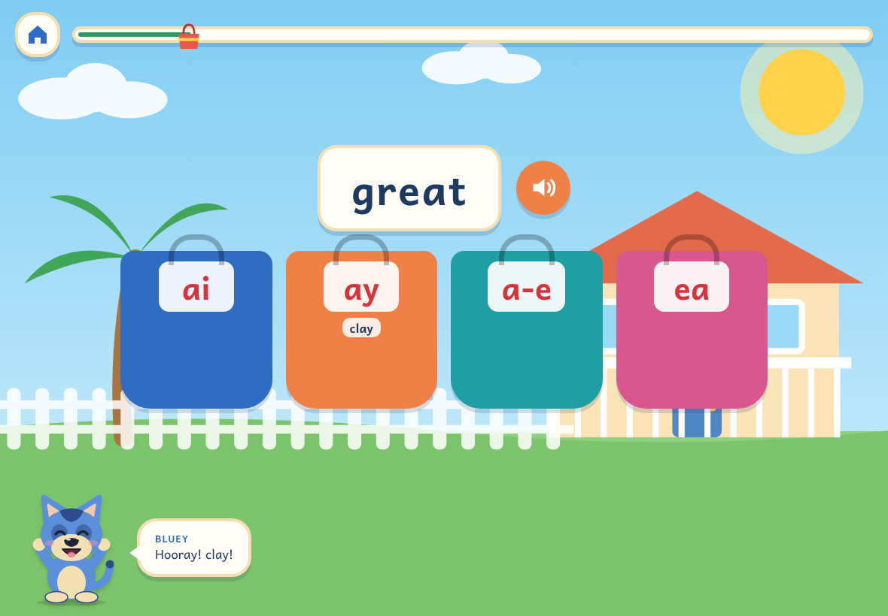

# Spelling Quest

A story-based spelling game for a tablet. Each school week is a chapter: two pups go on an adventure and need help sorting, finishing and spelling the week's words. The look and the story come from a swappable theme.



## How a chapter plays

1. **Story page** sets the scene.
2. **Sound Sort**: put each word in the bag for its spelling of the sound (ai / ay / a‑e / ea). Tap a bag or drag the word.
3. **Pick the Patch**: hear the word, see it with the sound missing, pick the right letters. A wrong pick shows the teacher's tip.
4. **Spell It**: look, say, cover, then build the word from letter tiles. Mistakes are shown in red and the word comes back later in the round.
5. **Tricky words** (like *said*) use the same look–cover–spell steps.
6. **The end**: a sticker for the sticker book.

Words are read aloud by the browser's own voice (a British voice when the device has one). Progress and stickers are saved in the browser on that device.

## Adding a week

Add a file to `public/content/weeks/`, named after the Monday of that week, and add its name to `public/content/weeks/index.json`. You can do this in GitHub's web editor.

```json
{
  "id": "2026-10-07",
  "title": "4 spellings of /ee/",
  "sound": "ee",
  "graphemes": ["ee", "ea", "e_e", "y"],
  "words": ["s[ee]", "b[ea]ch", "th[e]s[e]", "happ[y]"],
  "tricky": ["was"],
  "tips": { "y": "'y' makes the ee sound at the end of a long word." }
}
```

Square brackets mark the letters that make the sound (the red letters on the school sheet). A split spelling like a‑e gets two pairs of brackets: `m[a]k[e]`, and its grapheme is written `a_e`. Every word's spelling must be in `graphemes`, or the chapter won't load.

## Themes

A theme is a folder in `public/content/themes/` with a `theme.json` (characters, what they say, the story), a `theme.css` (colours and fonts) and an `art/` folder. See [THEMES.md](THEMES.md).

## Running it

```sh
npm install
npm run dev       # play it at the address shown; add --host to try it from a tablet on the same Wi-Fi
npm test          # word logic tests
npm run e2e       # plays a whole chapter in a tablet-sized browser
```

## Deploying privately (free)

Hosting is Cloudflare Pages, with Cloudflare Access in front so only the family can open it.

1. In the Cloudflare dashboard go to **Workers & Pages → Create → Pages → Connect to Git** and pick `spelling-quest`.
2. Framework preset **Vue** (or none), build command `npm run build`, output directory `dist`. Under environment variables set `NODE_VERSION` to `22`.
3. Deploy. Every merge to `main` redeploys automatically, including a new week file added in the GitHub web editor.
4. To make it private, open the Pages project's **Settings → General → Access policy** and enable it (or create a self-hosted application for the site's address in **Zero Trust → Access → Applications**). Add a policy that allows the family's email addresses. Visitors then get a one-time code by email before they can play. Also protect preview deployments if you share those links.

Search engines are asked not to index the site (`noindex` in `index.html` and `public/_headers`).
